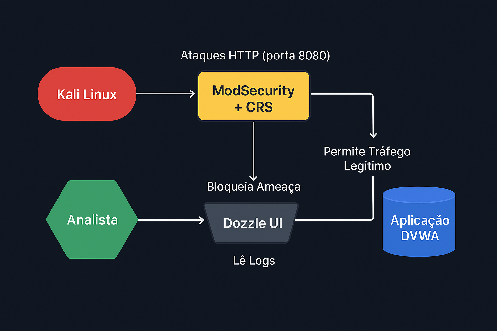
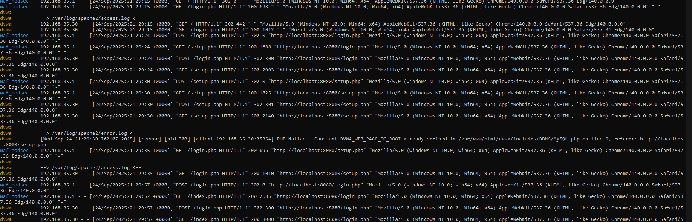
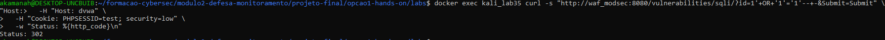
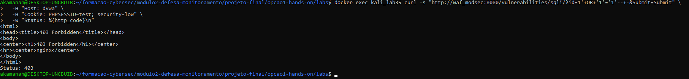
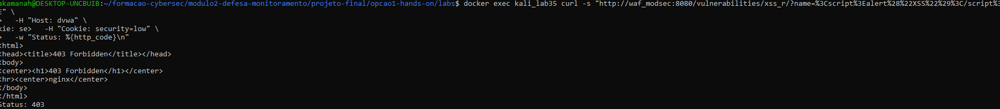
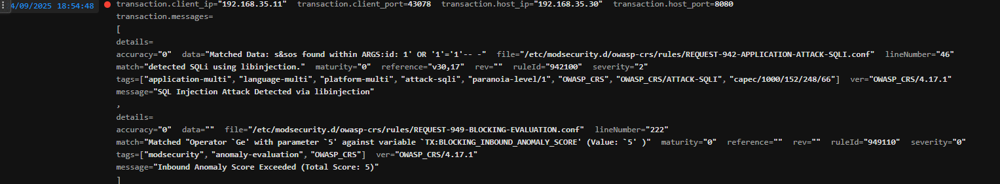
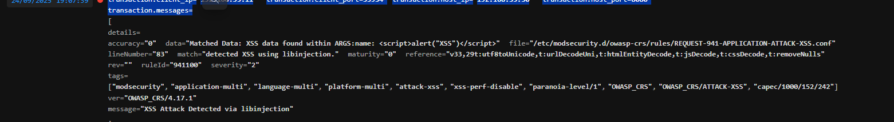

# **RELATÓRIO – Análise de Segurança e Resposta a Incidente com WAF ModSecurity**
> Wesley da Silva Pinheiro
 Data: 29-09-25

## 1. Sumário Executivo
Este relatório detalha os resultados de um exercício de segurança (hands-on) que simulou ataques comuns a aplicações web para testar a eficácia de um Web Application Firewall (WAF). Foi estabelecido um ambiente controlado com Docker, contendo um contêiner atacante (Kali Linux), uma aplicação web vulnerável (DVWA) e um WAF (ModSecurity com OWASP Core Rule Set). Foram executados ataques de **SQL Injection (SQLi)** e **Cross-Site Scripting (XSS)**. O WAF demonstrou sucesso em **detectar** as ameaças em um modo passivo e, posteriormente, em **bloqueá-las** ativamente após a reconfiguração, validando sua capacidade de proteger a aplicação alvo e fornecendo logs detalhados para análise e resposta a incidentes.

## 2. Objetivo e Escopo
O objetivo deste exercício foi simular um ciclo completo de ataque e defesa para:
*   Validar a capacidade do WAF ModSecurity com o OWASP Core Rule Set (CRS) em detectar e bloquear ataques de SQLi e XSS.
*   Demonstrar o processo de monitoramento e coleta de evidências em tempo real.
*   Executar um procedimento de resposta a incidentes, transitando o WAF do modo de detecção para o modo de bloqueio.
*   Documentar as evidências e alinhar as ações com o framework de Resposta a Incidentes do NIST.

O escopo do exercício está restrito ao ambiente de laboratório containerizado.

## 3. Arquitetura (Diagrama)
A arquitetura do laboratório simula um cenário de defesa em camadas, onde o tráfego destinado à aplicação web passa primeiro pelo WAF.


*   **Kali Linux (Atacante):** Origem dos ataques simulados.
*   **WAF (ModSecurity+CRS):** Camada de defesa responsável por inspecionar e filtrar o tráfego HTTP.
*   **DVWA (Aplicação Alvo):** Aplicação intencionalmente vulnerável.
*   **Dozzle (Monitoramento):** Ferramenta para visualização de logs dos contêineres em tempo real.

## 4. Metodologia
O exercício seguiu uma metodologia estruturada em fases, conforme o tutorial `TUTORIAL-COMPLETO.md`:
1.  **Configuração do Ambiente:** Utilização do Docker Compose para provisionar todos os contêineres do laboratório.
2.  **Reconhecimento:** Execução de um scan com `nmap` a partir do contêiner atacante para identificar os serviços expostos pelo WAF.
3.  **Fase 1 - Teste em Modo Detecção (`DetectionOnly`):** Simulação de ataques SQLi e XSS para confirmar que o WAF os identifica e gera logs, mas não os bloqueia.
4.  **Fase 2 - Resposta e Contenção:** Reconfiguração do WAF para o modo de bloqueio (`On`).
5.  **Fase 3 - Teste em Modo Bloqueio (`On`):** Repetição dos mesmos ataques para validar que o WAF agora os bloqueia ativamente.
6.  **Fase 4 - Coleta de Evidências:** Captura de logs, prints de tela e resultados dos comandos para documentação.

## 5. Execução e Evidências
As atividades foram executadas com sucesso, e as evidências coletadas confirmam a eficácia da solução de defesa.

#### **Reconhecimento (Nmap)**
O scan inicial a partir do contêiner Kali confirmou que o WAF estava expondo os serviços HTTP e HTTPS nas portas esperadas.
*   **Evidência:** Print de tela do resultado do `nmap`.
    > ```
    > PORT     STATE SERVICE  VERSION
    > 8080/tcp open  http     nginx
    > 8443/tcp open  ssl/http nginx
    > ```


#### **Ataques em Modo Detecção (`DetectionOnly`)**
Nesta fase, os ataques foram registrados, mas as requisições chegaram ao DVWA, resultando em um código de status `302` (redirecionamento), indicando que o ataque não foi bloqueado.
*   **Evidência:** Prints de tela mostrando os comandos `curl` com `Status: 302`.



#### **Ataques em Modo Bloqueio (`On`)**
Após a reconfiguração do WAF, os mesmos ataques foram repetidos. Desta vez, o WAF os interceptou e bloqueou, retornando o código de status `403 Forbidden`.
*   **Evidência:** Prints de tela mostrando os comandos `curl` com `Status: 403` e o corpo da resposta "403 Forbidden".



#### **Análise dos Logs de Bloqueio**
Os logs do contêiner `waf_modsec` forneceram detalhes precisos sobre o motivo dos bloqueios.
*   **Evidência Principal:** Arquivo `waf_modsec-2025-09-26.txt.txt` e prints do Dozzle.



**1. Bloqueio do Ataque de SQL Injection:**
O log confirma que a regra **942100** (SQL Injection Attack Detected) foi acionada, contribuindo para um score de anomalia que excedeu o limite, resultando no bloqueio pela regra **949110**.
> ```json
> {
>   "messages": [
>     {
>       "message": "SQL Injection Attack Detected via libinjection",
>       "details": {
>         "ruleId": "942100",
>         "data": "Matched Data: s&sos found within ARGS:id: 1' OR '1'='1'-- -",
>         ...
>       }
>     },
>     {
>       "message": "Inbound Anomaly Score Exceeded (Total Score: 5)",
>       "details": {
>         "ruleId": "949110",
>         ...
>       }
>     }
>   ]
> }
> ```

**2. Bloqueio do Ataque de Cross-Site Scripting (XSS):**
O log mostra que múltiplas regras de XSS (**941100, 941110, 941160**) foram acionadas pelo payload `<script>alert("XSS")</script>`, elevando o score de anomalia para 20 e resultando no bloqueio pela regra **949110**.
> ```json
> {
>   "messages": [
>     {
>       "message": "XSS Attack Detected via libinjection",
>       "details": {
>         "ruleId": "941100",
>         "data": "Matched Data: XSS data found within ARGS:name: <script>alert(\"XSS\")</script>",
>         ...
>       }
>     },
>     {
>       "message": "Inbound Anomaly Score Exceeded (Total Score: 20)",
>       "details": {
>         "ruleId": "949110",
>         ...
>       }
>     }
>   ]
> }
> ```

## 6. Resposta a Incidente (NIST IR)
As ações realizadas no laboratório podem ser mapeadas ao ciclo de vida de Resposta a Incidentes do NIST:

*   **Detecção e Análise:** A detecção ocorreu quando os ataques foram identificados nos logs do WAF (em modo `DetectionOnly` e `On`), conforme evidenciado no arquivo `waf_modsec-2025-09-26.txt.txt`. A análise dos logs em JSON permitiu identificar a origem do ataque (IP `192.168.35.11`), o vetor (`/vulnerabilities/sqli/` e `/vulnerabilities/xss_r/`) e a criticidade.
*   **Contenção:** A contenção foi implementada ao reconfigurar o WAF do modo `DetectionOnly` para o modo `On` e reiniciar o serviço. Esta ação impediu que novos ataques fossem bem-sucedidos.
*   **Erradicação e Recuperação:** Neste cenário, a erradicação foi instantânea com a ativação do modo de bloqueio, pois a ameaça foi eliminada na borda (WAF) antes de comprometer a aplicação. Não houve necessidade de recuperação do DVWA, pois o ataque foi contido com sucesso.
*   **Atividades Pós-Incidente (Lições Aprendidas):** O exercício demonstrou a importância de ter um WAF como camada de proteção e a criticidade de possuir um sistema de monitoramento de logs que permita uma análise rápida e uma resposta ágil.

## 7. Recomendações (80/20)
Com base nos resultados, as seguintes ações são recomendadas para um ambiente de produção:
1.  **Manter o WAF em Modo de Bloqueio (`On`):** A ação de maior impacto é garantir que o WAF esteja sempre operando em seu modo de proteção máxima para bloquear ameaças conhecidas.
2.  **Implementar Alertas Automatizados:** Integrar os logs do WAF a um sistema SIEM (Security Information and Event Management) para gerar alertas em tempo real para a equipe de segurança sempre que um bloqueio crítico ocorrer.
3.  **Corrigir as Vulnerabilidades na Fonte:** O WAF é uma camada de proteção essencial (virtual patching), mas a recomendação definitiva é corrigir as vulnerabilidades de SQLi e XSS diretamente no código da aplicação (DVWA).
4.  **Realizar Ajuste Fino (Tuning) das Regras:** Em um ambiente real, dedicar tempo para ajustar a sensibilidade das regras do OWASP CRS para minimizar falsos positivos e garantir que o tráfego legítimo não seja bloqueado.
5.  **Estabelecer um Processo de Revisão de Logs:** Agendar revisões periódicas dos logs do WAF para identificar novos padrões de ataque, avaliar a eficácia das regras e buscar anomalias que possam indicar ameaças desconhecidas.

## 8. Conclusão
O laboratório prático demonstrou com sucesso a maturidade e a eficácia de uma defesa baseada em WAF com ModSecurity e OWASP CRS. O ciclo completo de **detecção, análise, contenção e erradicação** foi executado, validando a capacidade da ferramenta de proteger uma aplicação vulnerável contra ataques de SQL Injection e Cross-Site Scripting. As evidências coletadas são inequívocas e confirmam que a solução, quando configurada corretamente, é uma camada de segurança robusta e indispensável na arquitetura de defesa cibernética.# projeto-final-2
